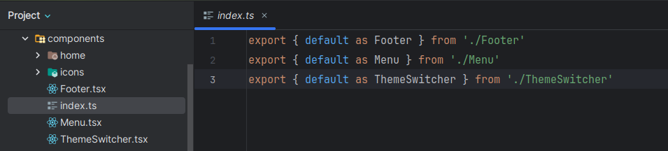
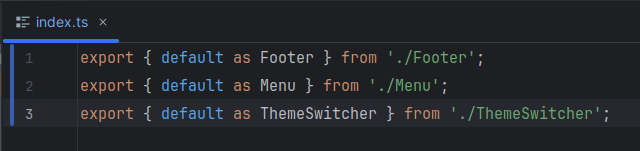
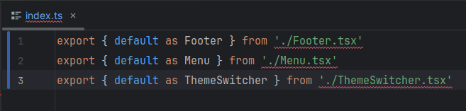
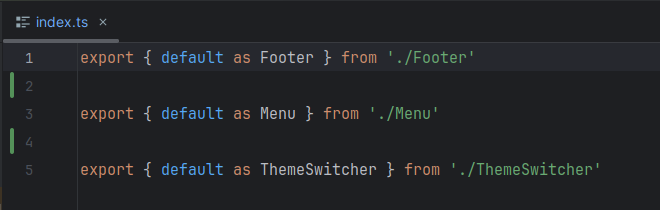
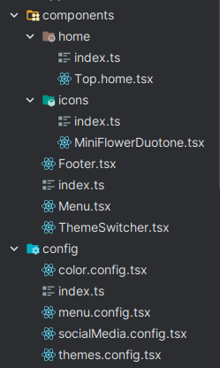
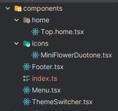

# barrel-tool

<div style="text-align:center; margin-top: 20px; margin-bottom: 20px;">
  
</div>


Barrel Tool is a utility designed to simplify the generation of "barrels" for your components. Barrels help efficiently
organize and export components from multiple files, making their importation more straightforward.

## Content

- [Installation](#-installation)
- [Usage](#-usage)
    - [Add your directory names](#--add-your-directory-names)
    - [Generate barrels](#--generate-barrels)
    - [Watch barrels](#--watch-barrels)
    - [Add to package.json scripts](#--add-to-packagejson-scripts-_optional_)
- [Settings](#-settings)
    - [Directory](#--directory)
    - [Save as](#--save-as)
    - [Use semicolon](#--use-semicolon)
    - [Use extension](#--use-extension)
    - [Separate by files](#--separate-by-files)
    - [Sub folders](#--sub-folders)
    - [Exclusions](#exclusions)

## # Installation

Install barrel-tool with npm

```bash
npm i -D barrel-tool
```

or pnpm

```bash
pnpm add --save-dev barrel-tool
```

After that, generate a `barrel.config.js`

```javascript
const barrelConfig = {
	dir: [
		// Add your folder names here:  './models', './utils'
	]
};

module.exports = barrelConfig;
```

## # Usage

### - Add your directory names

`barrel.config.js`

```javascript
const barrelConfig = {
	dir: [
		// For example
		'./models', './libs', './components'
	]
};

module.exports = barrelConfig;
```

### - Generate barrels

```bash
npx node node_modules/barrel-tool/src/barrel.generator.js 
```

### - Watch barrels

```bash
npx node node_modules/barrel-tool/src/barrel.watch.js
```

### - Add to package.json scripts _(optional)_

```json
"scripts": {
"barrel-generator": "npx node node_modules/barrel-tool/src/barrel.generator.js",
"barrel-watch": "npx node node_modules/barrel-tool/src/barrel.watch.js"
}
```

## # Settings

### - Directory

Specify the directories that will be included in the barrel.

default:

```javascript
dir: [
	// required
]
```

#### Example

```javascript
dir: [
	'./models', './utils', './components'
]
```



### - Save as

Specify the name of the barrel file. Recommended to use `index.ts`

default:

```javascript
saveAs: 'index.ts'
```

### - Use semicolon

Specify if you want to use semicolon at the end of each line.

default:

```javascript
useSemicolon: false
```

#### Example

```javascript
useSemicolon: true
```



### - Use extension

Specify if you want to use extension at the end of each line.

default:

```javascript
useExtension: false
```

#### Example

```javascript
useExtension: true
```



### - Separate by files

Specify if you want to separate the barrel by files.

default:

```javascript
separateByFiles: false
```

#### Example

```javascript
separateByFiles: true
```



### - Sub-folders

Specify if you want to include sub-folders.

default:

```javascript
subFolders: true
```



#### Example

```javascript
subFolders: false
```



### Exclusions

Soon, we will add exclusions.

## # Example

`barrel.config.js`

```javascript
const barrelConfig = {
	dir: [
		'./components'
	],
	subFolders: false,
	separateByFiles: true,
	useSemicolon: true
}

module.exports = barrelConfig
```